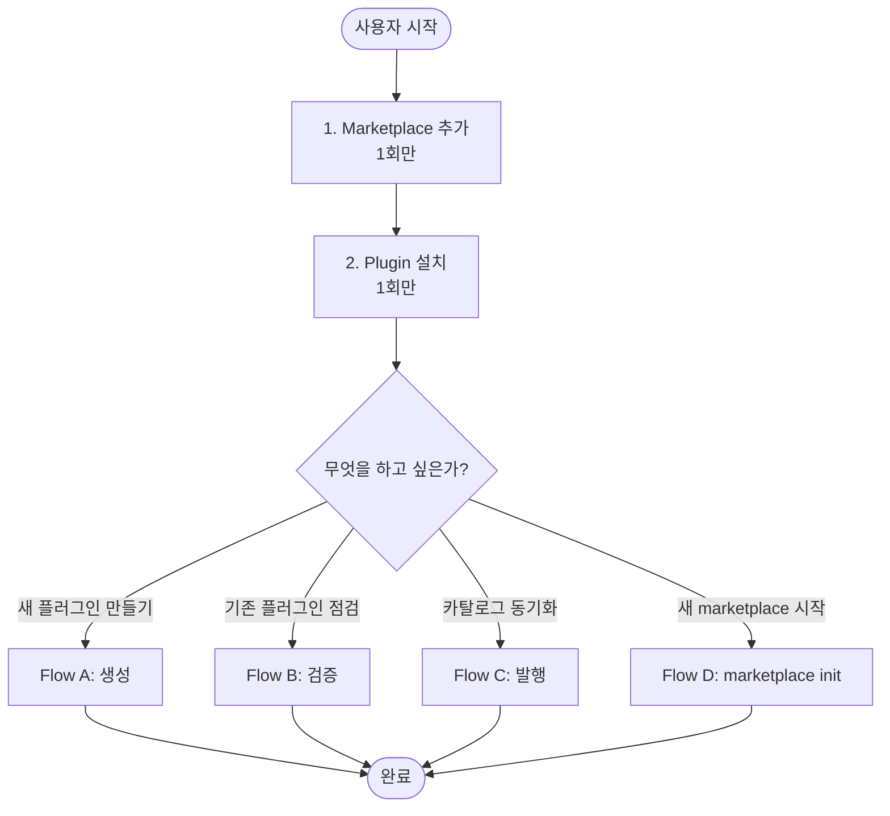
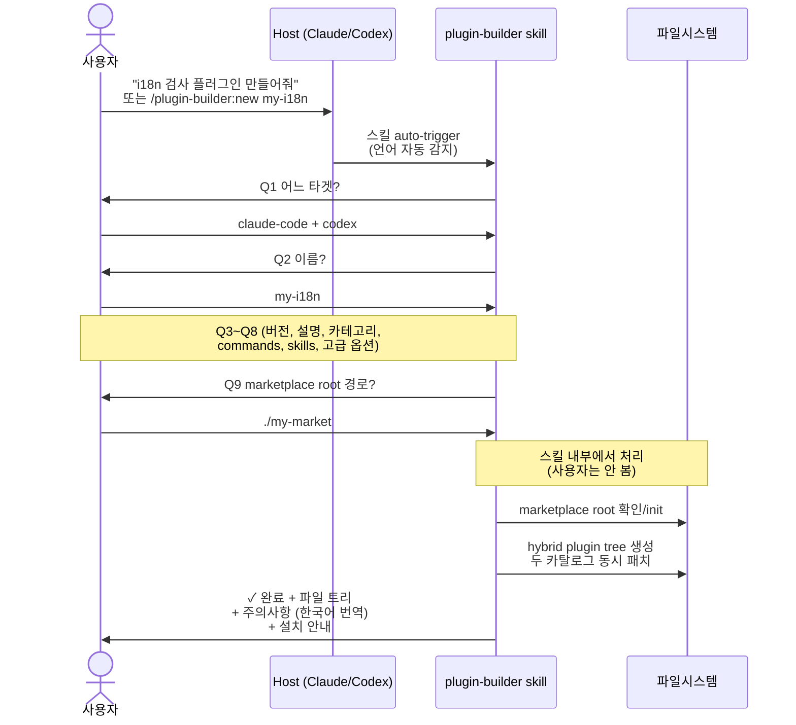
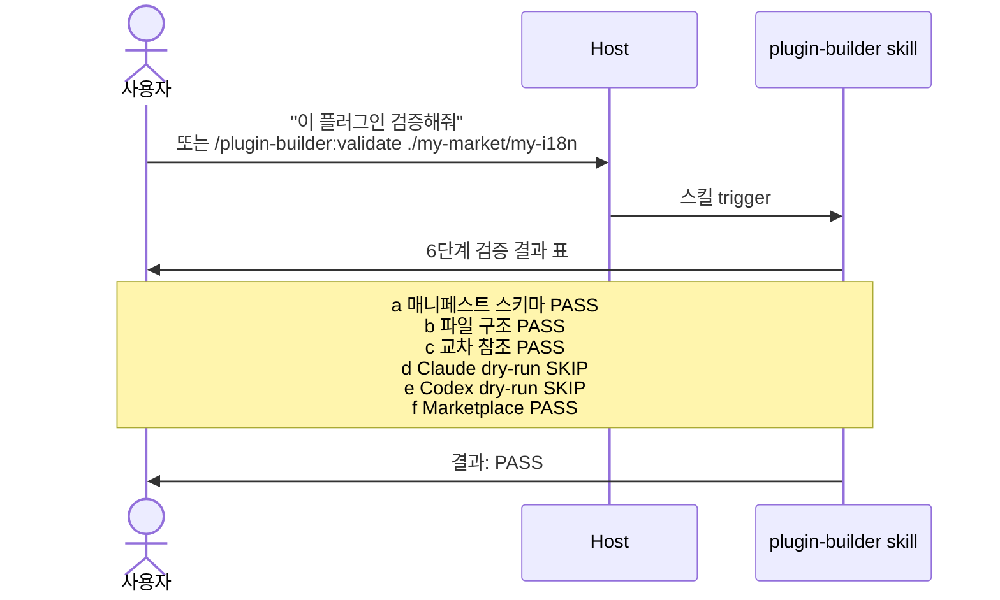
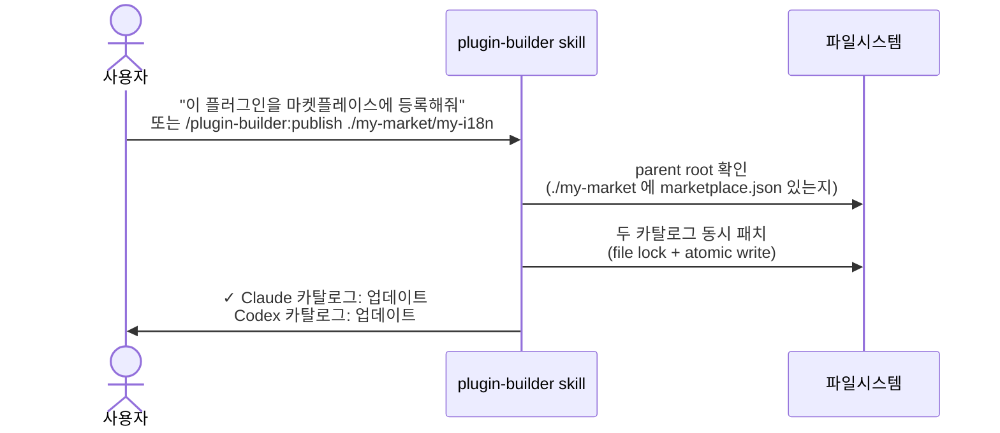
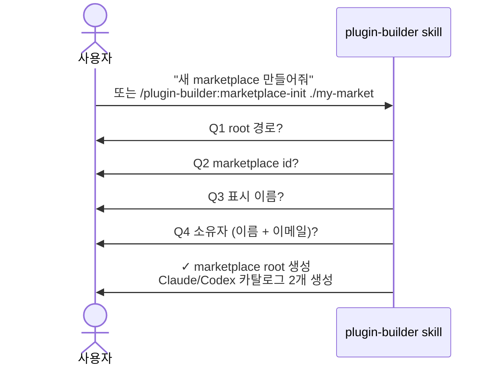

# plugin-builder — 사용자 흐름 (User Flow)

> 사용자 관점의 end-to-end 여정. **CLI 명령어를 직접 입력하지 않아도 되는** 흐름만 다룹니다.
>
> English version: [USER_FLOW.md](./USER_FLOW.md)
>
> CLI 직접 사용 (contributor / CI) → [internal/CLI.md](./internal/CLI.md), [USAGE.ko.md](./USAGE.ko.md)

---

## 0. 원칙

- **사용자는 CLI 를 모른다**. 진입은 항상 slash command 또는 자연어 발화.
- 모든 질문·결과는 사용자 언어 (한국어 / 영어) 로 자동 표시.
- 내부 처리는 스킬이 담당. 사용자는 답변만 입력.

---

## 1. Top-level Journey



---

## 2. 셋업 (1회)

### Step 1 — Marketplace 추가

**Claude Code 안에서:**
```
/plugin marketplace add developjik/plugin-tools
```

**Codex 안에서:**
```
codex plugin marketplace add github:developjik/plugin-tools
```

### Step 2 — Plugin 설치

**Claude Code:**
```
/plugin install plugin-builder@plugin-builder-official
```

**Codex:**
```
codex plugin install plugin-builder
```

이후 스킬과 슬래시 명령이 사용 가능.

---

## 3. Flow A — 새 플러그인 생성



### 사용자가 입력하는 것

- 자연어 발화 1줄 또는 `/plugin-builder:new [name]`
- Q1~Q9 답변

### 사용자가 보는 것

```
✓ my-i18n 플러그인 생성 완료

위치:
  ./my-market/my-i18n/
    ├── .claude-plugin/plugin.json
    ├── .codex-plugin/plugin.json
    ├── commands/, skills/, hooks/, .mcp.json, README.md

카탈로그 (자동 등록):
  ./my-market/.claude-plugin/marketplace.json — 신규 등록
  ./my-market/.agents/plugins/marketplace.json — 신규 등록

주의:
  ⚠ 'PermissionRequest' hook 은 Codex 전용이라 Claude 타겟에서 제거됐어요.

다음 단계:
  • Claude Code: /plugin marketplace add ./my-market
                 /plugin install my-i18n@my-market
  • Codex:       codex plugin marketplace add file://$PWD/my-market
                 codex plugin install my-i18n
```

---

## 4. Flow B — 기존 플러그인 검증



`SKIP` 이유 (Claude/Codex CLI 미설치 등) 는 사용자 언어로 설명.

---

## 5. Flow C — 카탈로그 발행



### 특성

- **Idempotent**: 동일 spec 재발행 = "변경 없음" (오류 아님)
- **Atomic**: tmp → fsync → rename, `.bak` 자동
- **Transaction**: Codex write 실패 시 Claude 는 이전 상태로 자동 롤백

---

## 6. Flow D — 새 marketplace 시작



이후 Flow A 로 새 플러그인을 이 root 안에 생성 가능.

---

## 7. UnifiedSpec → 산출물 매핑 (참고)

```mermaid
flowchart LR
    Spec[UnifiedSpec<br/>스킬 내부 합성] --> Tree[<root>/<name>/<br/>hybrid plugin tree]

    Tree --> O1[.claude-plugin/plugin.json]
    Tree --> O2[.codex-plugin/plugin.json<br/>+ interface 블록]
    Tree --> O3[commands/*.md<br/>Claude 전용]
    Tree --> O4[skills/<n>/SKILL.md<br/>Codex variant wins]
    Tree --> O5[skills/<n>/agents/openai.yaml<br/>codex 전용 invocation 시]
    Tree --> O6[hooks/claude.json<br/>+ hooks/codex.json]
    Tree --> O7[.mcp.json]
    Tree --> O8[README.md]

    Spec -.->|동시 패치.-> Cat1[<root>/.claude-plugin/<br/>marketplace.json]
    Spec -.->|동시 패치.-> Cat2[<root>/.agents/plugins/<br/>marketplace.json]
```

---

## 8. 자주 쓰는 자연어 예시

| 의도 | 자연어 발화 | 슬래시 명령 |
|---|---|---|
| 새 플러그인 생성 | "플러그인 만들어줘" | `/plugin-builder:new [name]` |
| 검증 | "이 플러그인 검증해줘" | `/plugin-builder:validate <dir>` |
| 발행 | "마켓플레이스에 등록해줘" | `/plugin-builder:publish <dir>` |
| marketplace 시작 | "새 marketplace 만들어줘" | `/plugin-builder:marketplace-init <root>` |

---

## 9. 다음 자료

- [README.ko.full.md](../README.ko.full.md) — 4단계 시작 가이드
- [USAGE.ko.md](./USAGE.ko.md) — 상세 spec reference (contributor 용)
- [internal/CLI.md](./internal/CLI.md) — 내부 CLI 흐름 (contributor 용)
- [../DESIGN.ko.md](../DESIGN.ko.md) — 아키텍처
