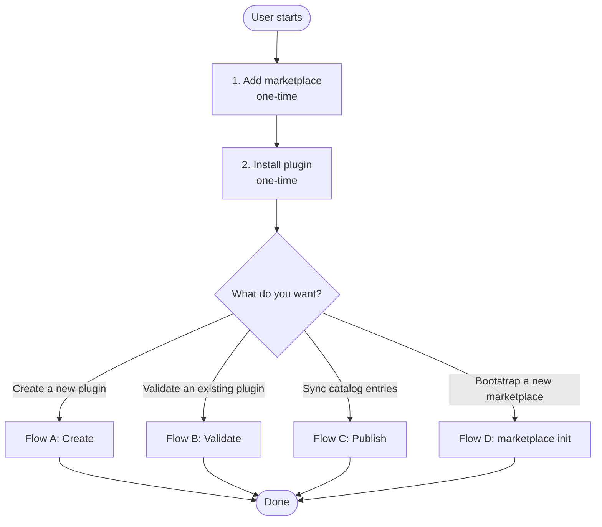
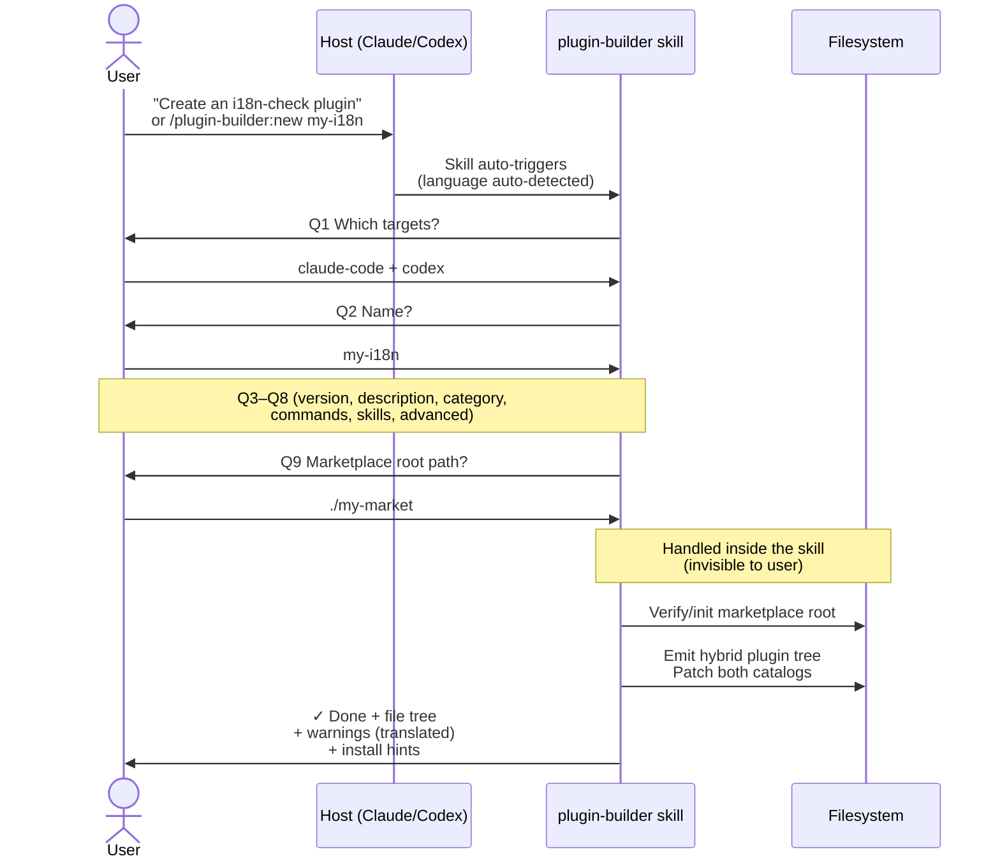
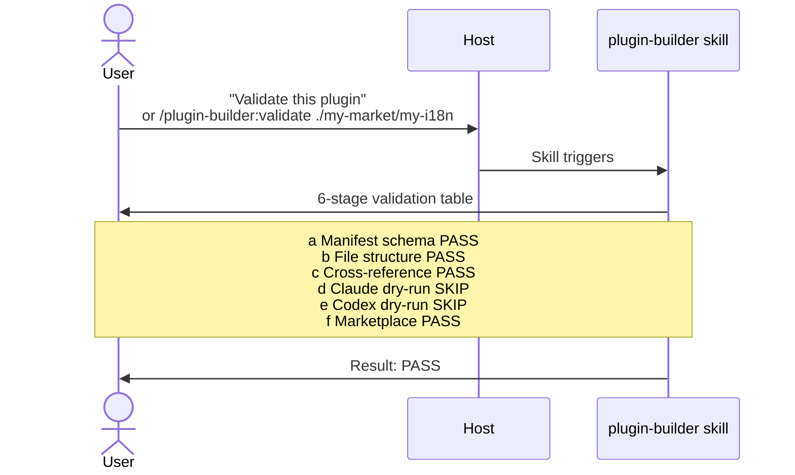
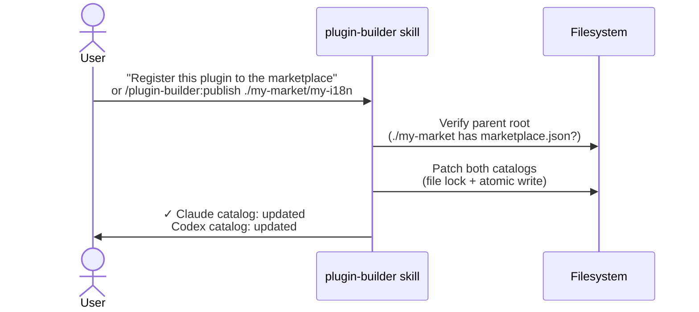
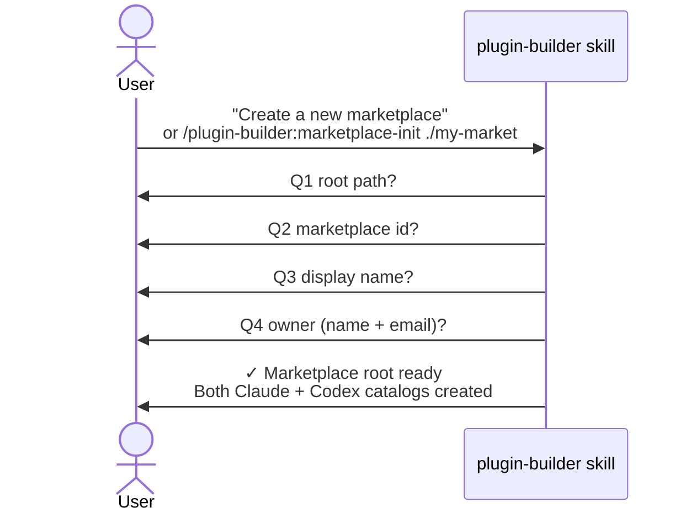

# plugin-builder — User Flow

> End-to-end journey from the user's perspective. Covers only the flow where **the user never types a CLI command**.
>
> 한국어판: [USER_FLOW.ko.md](./USER_FLOW.ko.md)
>
> Direct CLI usage (contributors / CI) → [internal/CLI.md](./internal/CLI.md), [USAGE.md](./USAGE.md)

---

## 0. Principle

- **Users do not know the CLI**. Entry is always a slash command or natural-language phrase.
- All questions and results appear in the user's language (Korean / English), detected automatically.
- The skill handles all internals. The user only answers.

---

## 1. Top-level Journey



---

## 2. Setup (one-time)

### Step 1 — Add the marketplace

**In Claude Code:**
```
/plugin marketplace add developjik/plugin-builder
```

**In Codex:**
```
codex plugin marketplace add github:developjik/plugin-builder
```

### Step 2 — Install the plugin

**Claude Code:**
```
/plugin install plugin-builder@plugin-builder-official
```

**Codex:**
```
codex plugin install plugin-builder
```

The skill and slash commands are now available.

---

## 3. Flow A — Create a new plugin



### What the user types

- One natural-language sentence, or `/plugin-builder:new [name]`
- Answers to Q1–Q9

### What the user sees

```
✓ Plugin my-i18n created

Location:
  ./my-market/my-i18n/
    ├── .claude-plugin/plugin.json
    ├── .codex-plugin/plugin.json
    ├── commands/, skills/, hooks/, .mcp.json, README.md

Catalogs (auto-patched):
  ./my-market/.claude-plugin/marketplace.json — new entry
  ./my-market/.agents/plugins/marketplace.json — new entry

Notes:
  ⚠ 'PermissionRequest' hook is Codex-only and was dropped from the Claude target.

Next steps:
  • Claude Code: /plugin marketplace add ./my-market
                 /plugin install my-i18n@my-market
  • Codex:       codex plugin marketplace add file://$PWD/my-market
                 codex plugin install my-i18n
```

---

## 4. Flow B — Validate an existing plugin



`SKIP` reasons (e.g. Claude/Codex CLI not installed) are explained in the user's language.

---

## 5. Flow C — Publish to catalogs



### Properties

- **Idempotent**: re-publishing with the same spec → "no change" (not an error)
- **Atomic**: tmp → fsync → rename, `.bak` automatic
- **Transactional**: if Codex write fails, Claude rolls back to its pre-transaction content

---

## 6. Flow D — Bootstrap a new marketplace



After this, Flow A can scaffold new plugins into the root.

---

## 7. UnifiedSpec → output mapping (reference)

```mermaid
flowchart LR
    Spec[UnifiedSpec<br/>synthesized inside skill] --> Tree[<root>/<name>/<br/>hybrid plugin tree]

    Tree --> O1[.claude-plugin/plugin.json]
    Tree --> O2[.codex-plugin/plugin.json<br/>+ interface block]
    Tree --> O3[commands/*.md<br/>Claude only]
    Tree --> O4[skills/<n>/SKILL.md<br/>Codex variant wins]
    Tree --> O5[skills/<n>/agents/openai.yaml<br/>when codex invocation set]
    Tree --> O6[hooks/claude.json<br/>+ hooks/codex.json]
    Tree --> O7[.mcp.json]
    Tree --> O8[README.md]

    Spec -.->|auto-patch.-> Cat1[<root>/.claude-plugin/<br/>marketplace.json]
    Spec -.->|auto-patch.-> Cat2[<root>/.agents/plugins/<br/>marketplace.json]
```

---

## 8. Common natural-language phrases

| Intent | Natural language | Slash command |
|---|---|---|
| Create a new plugin | "Create a plugin" / "Make a plugin" | `/plugin-builder:new [name]` |
| Validate | "Validate this plugin" | `/plugin-builder:validate <dir>` |
| Publish | "Register to the marketplace" | `/plugin-builder:publish <dir>` |
| Bootstrap marketplace | "Create a new marketplace" | `/plugin-builder:marketplace-init <root>` |

---

## 9. See also

- [README.full.md](../README.full.md) — 4-step quick start
- [USAGE.md](./USAGE.md) — detailed spec reference (for contributors)
- [internal/CLI.md](./internal/CLI.md) — internal CLI flow (for contributors)
- [../DESIGN.md](../DESIGN.md) — architecture
